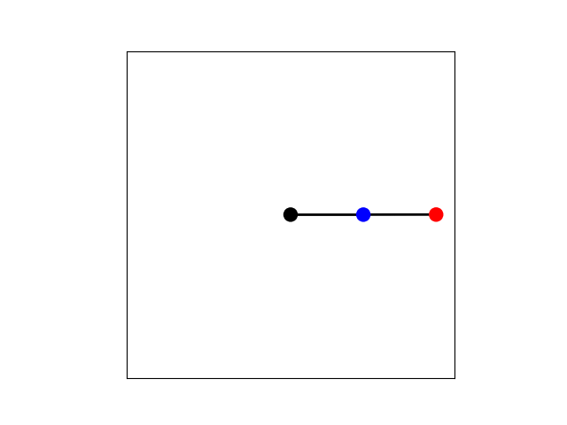

# Double Pendulum
Learn how to model, simulate, and animate the simple and compound double pendulum. Both Jupyter Notebook and Python source files are provided.

## Video Links
- [Simulate 1000 Double Pendulums in Python! (Lagrangian Mechanics)](https://youtu.be/sxL3KQgFLcI)

## Derivation

#### Position of Center of Mass (CoM)
For the simple pendulum, the masses are concentrated to a single point at the end of the rod.

$`p_1 = \begin{bmatrix} L_1 \sin \theta_1\\ -L_1 \cos \theta_1 \end{bmatrix} = \begin{bmatrix} p_{1,x} \\ p_{1,y} \end{bmatrix}`$

$`p_2 = \begin{bmatrix} L_1 \sin \theta_1 + L_2 \sin \theta_2\\ -L_1 \cos \theta_1 -L_2 \cos \theta_2 \end{bmatrix} = \begin{bmatrix} p_{2,x} \\ p_{2,y} \end{bmatrix}`$

For the compond pendulum, the masses are distributed along the rod equally. The CoM is assumed to be at the center of the rod.

$`p_1 = \begin{bmatrix} \frac{1}{2} L_1 \sin \theta_1\\ - \frac{1}{2} L_1 \cos \theta_1 \end{bmatrix} = \begin{bmatrix} p_{1,x} \\ p_{1,y} \end{bmatrix}`$

$`p_2 = \begin{bmatrix} L_1 \sin \theta_1 + \frac{1}{2} L_2 \sin \theta_2\\ -L_1 \cos \theta_1 - \frac{1}{2} L_2 \cos \theta_2 \end{bmatrix} = \begin{bmatrix} p_{2,x} \\ p_{2,y} \end{bmatrix}`$

#### Velocity of CoM
For both the simple and compound pendulum, let $`v_1 = \dot{p}_1`$ and $`v_2 = \dot{p}_2`$

#### Moment of Inertia about CoM
For the simple pendulum, let
$I_1 = I_2 = 0$. 

For the compound pendulum, let 
$I_1 = \frac{1}{12}m_1 L_1^2$ and $I_2 = \frac{1}{12}m_2 L_2^2 $.

#### Kinetic energy
$$T = \frac{1}{2} m_1 ||v_1||^2 +  \frac{1}{2} m_2 ||v_2||^2 +  \frac{1}{2} I_1 \dot{\theta}_1^2 + \frac{1}{2} I_2 (\dot{\theta}_1 + \dot{\theta}_2)^2$$

#### Potential energy
Potential energy uses the y-coordinate of the CoM position only.

$$V = m_1 g p_{1,y} + m_2 g p_{2,y}$$

#### Lagrangian
Always the difference between kinetic and potential energy.
$$L = T - V$$

#### Euler-Lagrange Equations
One equation for each pendulum arm. 

To model torque control, replace the zero in equation 1 with a torque $\tau_1$ and replace the zero in equation 2 with a torque $\tau_2$.
$$\frac{d}{dt}\bigg( \frac{\partial L}{\partial \dot{\theta}_1} \bigg) - \frac{\partial L}{\partial \theta_1} = 0$$

$$\frac{d}{dt}\bigg( \frac{\partial L}{\partial \dot{\theta}_2} \bigg) - \frac{\partial L}{\partial \theta_2} = 0$$

#### Equations of Motion
See code. Expressions are too long to fit onto the screen!

## Diagram

  

## Description of Symbols
| Symbols  | Description | Unit |
| ------------- | ------------- | ------------- |
| $g$  | Acceleration due to gravity | m/s^2  |
| $m_1$  | Mass of rod 1 | kg  |
| $m_2$  | Length of rod 2 | kg |
| $L_1$  | Length of rod 1 | m |
| $L_2$  | Length of rod 2 | m |
| $I_1$  | Moment of inertia rod 1 about CoM | kg-m^2 |
| $I_2$  | Moment of inertia rod 2 about CoM | kg-m^2 |
| $\theta_1$  | Angle of rod 1 from vertical | rad |
| $\theta_2$  | Angle of rod 2 from rod 1 | rad |
| $p_1$  | Position of rod 1 CoM in {s} frame | m |
| $p_2$  | Position of rod 2 CoM in {s} frame | m |
| $v_1$  | Velocity of rod 1 CoM in {s} frame | m/s |
| $v_2$  | Velocity of rod 2 CoM in {s} frame | m/s |
| $T$  | Kinetic Energy of System | J |
| $V$  | Potential Energy of System | J |
| $L$  | Lagrangian of System | J |

## What You'll Make

  

  

