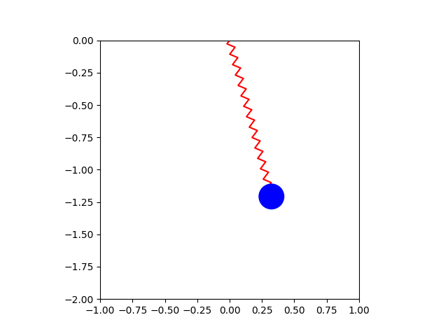

# Elastic Pendulum
Learn how to model, simulate, and animate the elastic pendulum in Python. Both Jupyter Notebook and Python source files are provided.

## Video Links
- [Simulate Elastic Pendulum in Python (Lagrangian Mechanics)](https://youtu.be/K6FzJUDPE9M)

## What You'll Make

  

