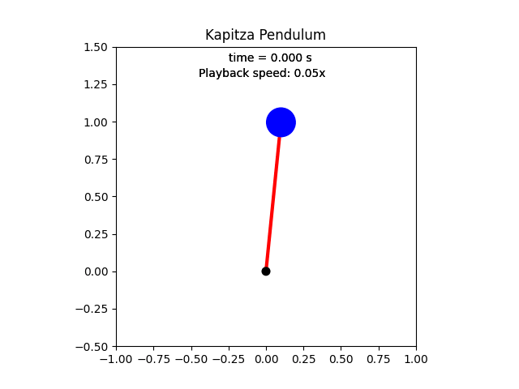

# Kapitza Pendulum
Learn how to model, simulate, and animate the Kapitza pendulum in Python. Both Jupyter Notebook and Python source files are provided.

## Video Links
- [Kapitza Pendulum: Model + Simulate + Animate (Lagrangian Mechanics)]([https://youtu.be/K6FzJUDPE9M](https://youtu.be/oeneVhFh4-o))

## What You'll Make

  

