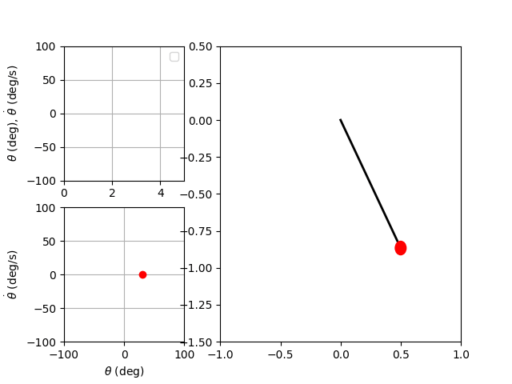

# Simple Pendulum
Learn how to model, simulate, and animate a simple pendulum in Python. Both Jupyter Notebook and Python source files are provided. 

## Video Links
- [Model Pendulum by Hand](https://youtu.be/0PUrSlr6XCk)
- [Model Pendulum with Python](https://youtu.be/ZCzIoaGls4g)
- [Simulate and Animate Pendulum with Python](https://youtu.be/WNJJuSWfuTY)

## What You'll Make

  

## Troubleshooting
On Windows, if you see a `FileNotFoundError: [WinError 2] The system cannot find the file specified` after trying to save a `.mp4` file, you may not have `ffmpeg` installed. To check if `ffmpeg` is installed and added to your `PATH` variable correctly, open a command prompt window and run the command `ffmpeg`. If you see a message showing the version of `ffmpeg` installed, then you have `ffmpeg` installed properly already. If `ffmpeg` is not installed, install it by doing the following:
1. [Download ffmpeg](https://www.ffmpeg.org/download.html) from their website to your Downloads folder.
2. Extract the zipped folder to your Downloads folder.
3. Cut and paste the extracted folder to `C:\Users\Programs`.
4. In the extracted folder you just pasted, navigate until your find the `bin` folder. Right click on the `bin` folder and copy its path. 
5. Press the windows key and type `Edit the System Variables`. 
6. Click `Environmental Variables`, then under the `System Variables` tab, select `Path` and then click the `Edit` button.
7. Click `New` and paste in the path to the `bin` folder you copied in step 4.
8. Press `OK` until the window closes.
9. Open a new command window and run the command `ffmpeg`. If you see a message showing the version of `ffmpeg`, then you have `ffmpeg` configured properly.
10. Close and re-open visual studio. Run the program again, and the `.mp4` file should be created successfully.