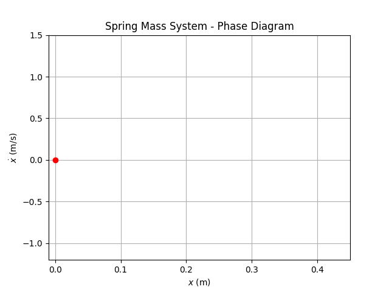

# Spring Mass
Learn how to model, simulate, and animate a spring mass system Python. Both Jupyter Notebook and Python source files are provided. 

## Video Links
- [Model + Simulate Spring Mass in Python](https://youtu.be/HaQwLfKOvKI)

## What You'll Make

  

