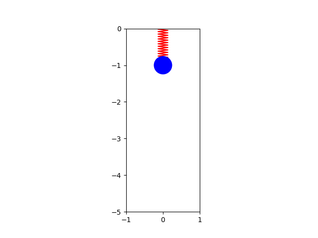
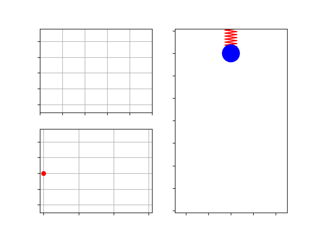

# Spring Mass
Learn how to model, simulate, and animate a spring mass system Python. Both Jupyter Notebook and Python source files are provided.

## Animations
In `Animate.py` we use Affine transforms to animate the spring mass system in isolation.

  

In `Animate_triple.py` we also include time plots of the position and velocity, as well as a phase diagram.

  

## Video Links
- [Model + Simulate Spring Mass in Python](https://youtu.be/HaQwLfKOvKI)
- [Animate Spring Mass with Affine Transformations in Python](https://youtu.be/mX1VDOY6wVc)
